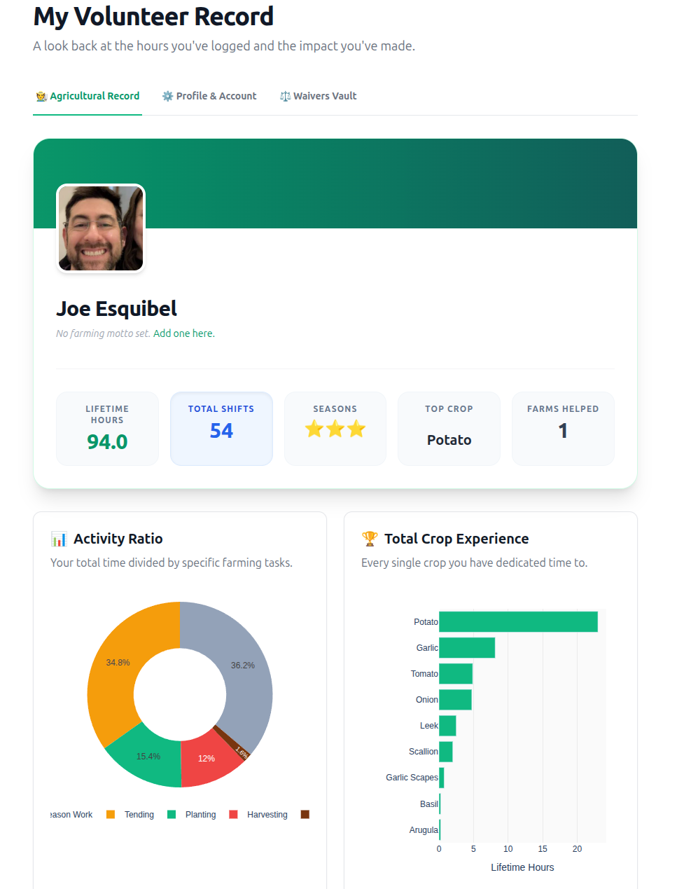
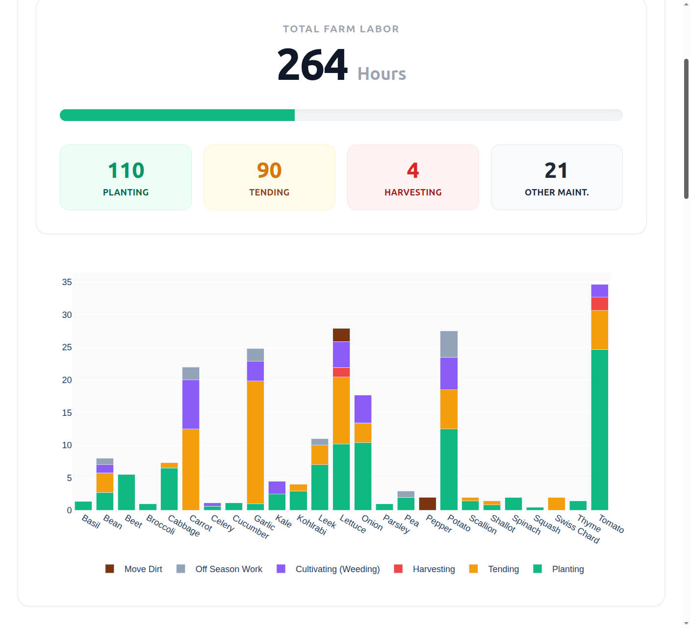

# 🚜 Helping Farmers Farm: Volunteer & Labor Management Platform

Welcome to the backend repository for **[Helping Farmers Farm](https://www.helpingfarmersfarm.com)**. 

This platform is purpose-built to connect eager community members with local agriculture while giving farm managers the tools they need to effortlessly manage their workforce. We help Community Supported Agriculture (CSA) programs, co-ops, and independent farms seamlessly track seasonal work commitments, manage digital liability waivers, and visualize their community impact.

---

## 📸 Platform Highlights

*(Note: The images below reference the static assets served on the live platform).*

### The Volunteer Experience
Volunteers use the platform to discover local farms, log their time in the dirt, and track their lifetime agricultural impact.



### The Manager Command Center
Farm Managers ditch the clipboard and use the platform to oversee their roster, ensure seasonal work-share commitments are met, and monitor digital liability waivers.



---

## 🏗 System Architecture & Domain Map
While the focus is on community agriculture, the platform relies on a robust ecosystem strictly divided into domain-specific applications. For deep technical details and architectural rules, please refer to the `readme.md` located inside each app's folder.

* 👤 **`accounts/`**: The identity engine handling secure user authentication, RBAC roles, Cropper.js avatar uploads, and the legacy claim flow.
* 🌾 **`farms/`**: Multi-tenant boundaries that house the CRM-style Manager Dashboards and the Global Pacing Engine.
* 🕒 **`logs/`**: The transactional core where shift logging, double-click prevention, personal pacing, and achievement badges are processed.
* 📊 **`analytics/`**: The HTMX-driven Plotly engine that translates raw labor data into visual DataFrames, Heatmaps, and KPI dashboards.
* ⚙️ **`helpingfarmersfarm/`**: The core configuration folder containing settings, security headers, root URLs, Sentry monitoring, and audit logging.
* 🎨 **`theme/`**: The `django-tailwind` application housing the Node.js CSS build pipeline.

---

## 📂 Developer Utilities
This root directory contains several critical utility files that power the development and deployment pipelines.

* **`Procfile`**: Used in conjunction with Honcho to manage multiple local development processes simultaneously. It defines the `web` process to run the standard Django server and the `tailwind` process to run the Node CSS watcher.
* **`generate_content.py`**: A custom-built ingestion script designed specifically for LLM-assisted development. It bundles relevant `.py`, `.html`, and configuration files into a single `llm_context.txt` file, intelligently filtering out heavy folders (like `__pycache__` and `node_modules`) and binary extensions to keep the token count lean.
* **`manage.py`**: The standard Django command-line utility for administrative tasks (migrations, superuser creation, shell access).

---

## 🛠 Local Development Workflow
 

Because this project relies heavily on a custom Tailwind CSS pipeline, you must run both the Django server and the Tailwind watcher simultaneously. To spin up the local environment, simply run:

```bash
honcho start
```
